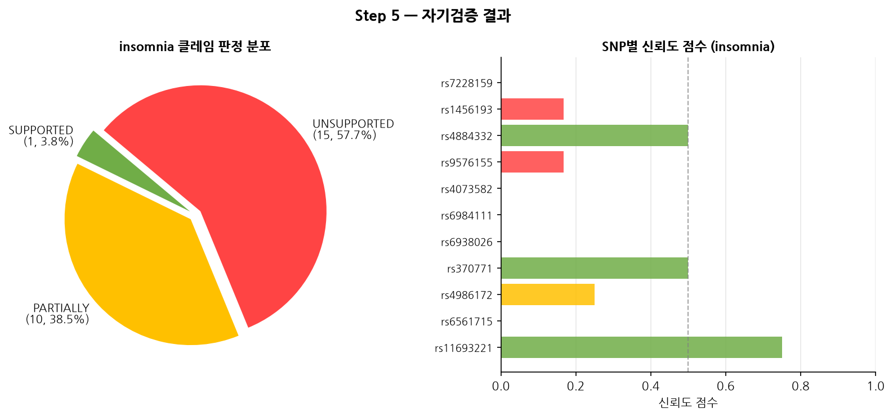
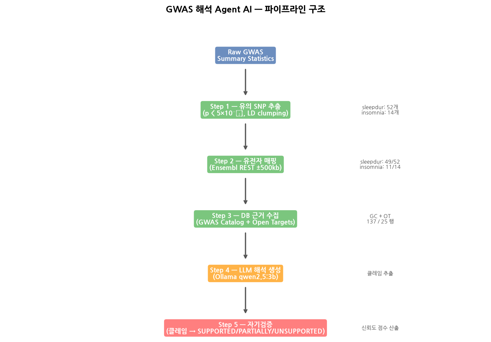
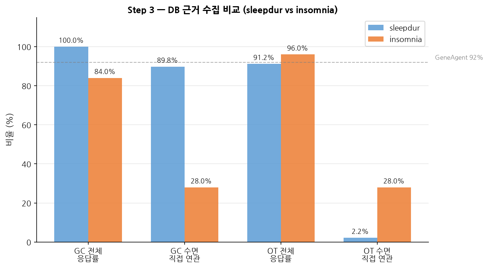
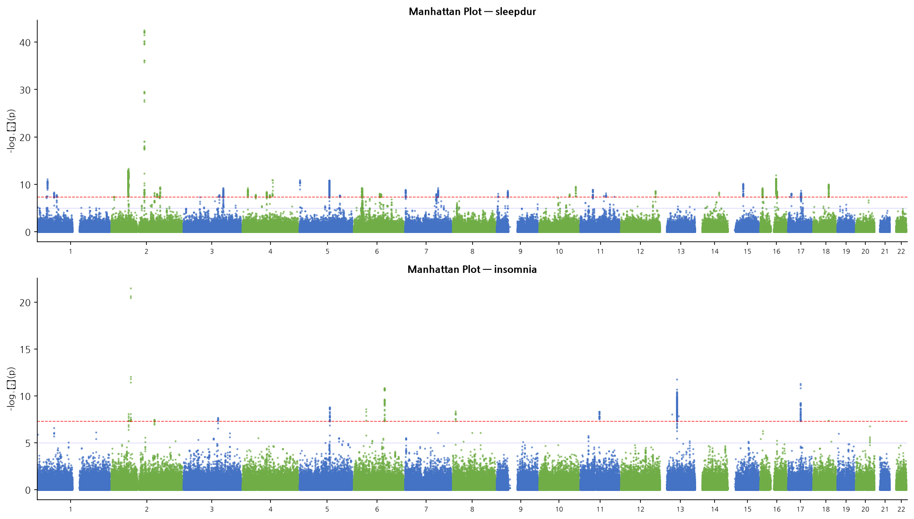

# 중간보고서
## 유전체 연관분석 결과 해석을 위한 검증형 Agent AI 시스템 개발

---

## 연구진행상황요약

### 데이터셋
- **수면 시간 GWAS** (sleepdur): Jansen et al. (Nature Genetics, 2019), UK Biobank 단독 (N≈379,000, SNP 10,862,567개)
- **불면증 GWAS** (insomnia): Jansen et al. (Nature Genetics, 2019), N≈381,000, SNP 10,862,567개
- 두 표현형 모두 GRCh37(hg19) 좌표 기반 동일 형식의 summary statistics 파일

> 논문 보고 sleepdur 78 loci는 23andMe 메타분석 결과이며, 공개 파일은 UK Biobank 단독으로 23andMe 미포함.

---

### Step 1 — 유의 SNP 추출 ✅ 완료

전장유전체 유의성 기준(p < 5×10⁻⁸) 및 500kb 그리디 LD clumping 적용.

| 항목 | sleepdur | insomnia |
|------|----------|----------|
| 전체 SNP | 10,862,567개 | 10,862,567개 |
| p < 5×10⁻⁸ 유의 SNP | 3,886개 | 463개 |
| LD clumping 후 lead SNP | **52개** | **14개** |
| 최강 신호 | rs62158206 (chr2, p=3.0×10⁻⁴³) | rs11693221 (chr2, p=3.1×10⁻²²) |
| LD clumping 정합성 (500kb 내 중복 쌍) | 0개 ✓ | 0개 ✓ |

---

### Step 2 — 유전자 매핑 ✅ 완료

Ensembl REST API(GRCh37 전용 엔드포인트), 각 lead SNP 기준 ±500kb 단백질 코딩 유전자 조회.

| 항목 | sleepdur | insomnia |
|------|----------|----------|
| 매핑 성공 SNP | 49/52 (94.2%) | 11/14 (78.6%) |
| 인터제닉 SNP (유전자 없음) | 3개 | 3개 |
| 고유 후보 유전자 수 | 196개 | 37개 |
| SNP당 평균 후보 유전자 수 | 8.3개 | 3.4개 |

**주요 매핑 유전자:**
- sleepdur: PAX8, FTO, SLC6A3, FOXP2, MAPT, NOS1, RBFOX1, TCF4, GRM5 등
- insomnia: MEIS1, LIN28B, TCF4, DIAPH3, LSAMP, CNIH2 등

---

### Step 3 — 근거 수집 ✅ 완료

유전자 있는 SNP의 상위 3개 유전자에 대해 GWAS Catalog(SNP 단위) 및 Open Targets GraphQL(유전자 단위) 조회.

#### sleepdur (137 유전자-SNP 쌍)

| DB | 응답률 | 수면 직접 연관 |
|----|--------|---------------|
| GWAS Catalog | 137/137 (100%) | **123/137 (89.8%)** |
| Open Targets | 125/137 (91.2%) | 3/137 (2.2%) |

#### insomnia (25 유전자-SNP 쌍)

| DB | 응답률 | 불면증/수면 직접 연관 |
|----|--------|----------------------|
| GWAS Catalog | 21/25 (84.0%) | **7/25 (28.0%)** |
| Open Targets | 24/25 (96.0%) | 7/25 (28.0%) |

GC 빈 행(4행): rs6984111-MSRA/PRSS55/RP1L1, rs1456193-LSAMP → GWAS Catalog 미등록 SNP (정상).  
OT 빈 행(1행): rs370771-BVES → Open Targets 미등록 유전자 (정상).

**insomnia 주요 GWAS Catalog 직접 근거:**
- rs6561715 (OLFM4, PCDH8): "Insomnia (standard GWA) | Insomnia"
- rs4884332 (DIAPH3): "Insomnia"
- rs11693221 (MEIS1): "Sleep medication purchases | Short sleep duration (<5 hours)"

---

### Step 4 — LLM 해석 생성 🔄 진행 중

Ollama qwen2.5:3b (로컬 GPU 추론, GTX 1650 Super)를 사용하여 각 SNP에 대해 DB 근거 기반 해석 텍스트를 생성하고, 응답에서 검증 가능한 클레임 목록을 추출한다.

- 초기 Gemini API 시도 → 무료 티어 rate limit으로 로컬 Ollama로 전환
- 클레임 추출: `### 클레임 목록`, `[클레임 목록]`, `클레임 목록:` 등 다양한 출력 형식을 정규식으로 통합 처리

### Step 5 — 자기검증 (insomnia 1차 완료)

추출된 각 클레임을 DB 근거와 재대조하여 SUPPORTED / PARTIALLY_SUPPORTED / UNSUPPORTED 판정. 신뢰도 점수 = Σ(1.0·S + 0.5·P) / 전체 클레임.

#### insomnia Step 4~5 결과 (qwen2.5:3b, 1차)

| 항목 | 수치 |
|------|------|
| 처리 SNP | 11개 |
| 클레임 추출 성공 | 11/11 (100%) |
| 전체 검증 클레임 | 26개 |
| SUPPORTED | 1 (3.8%) |
| PARTIALLY_SUPPORTED | 10 (38.5%) |
| UNSUPPORTED | 15 (57.7%) |
| DB 지지율 (S+P) | **42.3%** |
| 평균 신뢰도 점수 | 0.212 |

UNSUPPORTED 비율이 높은 원인으로는 (1) qwen2.5:3b의 작은 모델 크기로 인한 지시 이탈, (2) 자기검증 프롬프트 최적화 미완료가 지목된다. sleepdur Step 4~5는 현재 실행 중.

---

## 연구진행중간결론

### 1. 전체 파이프라인 작동 확인

sleepdur, insomnia 모두 Step 1~5 end-to-end 파이프라인이 정상 작동하였다. 입력-출력 SNP/유전자 ID 일치율 100%, 누락 행 없음.

### 2. H2 가설 방향 지지 (sleepdur)

GWAS Catalog 수면 직접 근거 지지율 89.8%는 GWAS 특화 DB가 수면 표현형에 대해 높은 직접 근거를 제공한다는 H2 가설 방향을 지지한다. Open Targets의 수면 직접 연관 비율은 2.2%로, 희귀 단일유전자 질환 중심 DB로서 수면 연구 활용도가 제한적임을 확인하였다.

### 3. insomnia GWAS Catalog 직접 근거 비율 차이
insomnia에서 GWAS Catalog 직접 근거(insomnia/sleep)는 28.0%로 sleepdur(89.8%) 대비 낮다. 이는 불면증 GWAS 연구 수가 수면 시간 대비 적어 Catalog 등록 수가 제한적이기 때문이다. 반면 Open Targets에서도 동일하게 28.0%를 기록하여, insomnia에 한해서는 두 DB의 직접 근거 제공 능력이 유사하다.

### 4. Locus 재현율

sleepdur 52개 lead SNP는 논문 보고 78개 대비 66.7% 수준 (UK Biobank 단독 데이터 한계). insomnia 14개 lead SNP는 논문 보고(Jansen et al.) 수준에 부합한다.

### 5. 어셈블리 불일치 버그 발견 및 수정
초기 구현에서 GRCh38 기반 Ensembl API를 사용하여 유전자 매핑 오류가 발생하였다 (rs62158206에서 PAX8 대신 ACTR3 매핑). Jansen 데이터가 GRCh37 좌표임을 확인하고 전용 엔드포인트로 수정 후 재실행하여 논문 보고 locus와 일치하는 결과를 확인하였다.

---

## 연구계획변경사항

| 항목 | 기존 계획 | 변경 내용 | 변경 이유 |
|------|-----------|-----------|-----------|
| 분석 표현형 | 수면 시간 단일 | **sleepdur + insomnia 양 표현형** | 비교 분석으로 H2 검증 강화 |
| LLM 모델 | Claude (Anthropic API) | **Ollama qwen2.5:3b** (로컬) | Gemini API 무료 티어 rate limit 초과 |
| LD clumping | PLINK 기반 r² < 0.1 | 거리 기반 그리디 (500kb) | 외부 도구 의존성 제거, PLINK 교체는 추후 과제 |
| Step 3 DB 구성 | GWAS Catalog + GTEx + Open Targets + PubMed | GWAS Catalog + Open Targets 우선 구현 | GTEx SNP ID 형식 변환 필요, PubMed는 차순위 |
| 입력 데이터 | UK Biobank + 23andMe 메타분석 | UK Biobank 단독 | 23andMe 데이터 공유 제한 |
